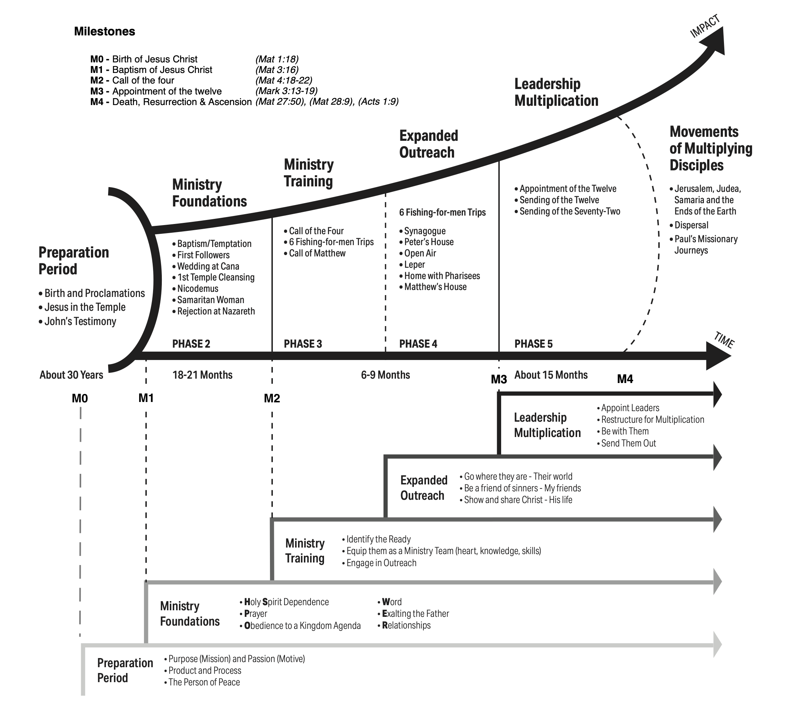
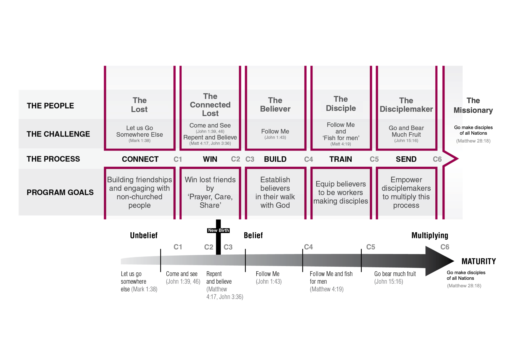
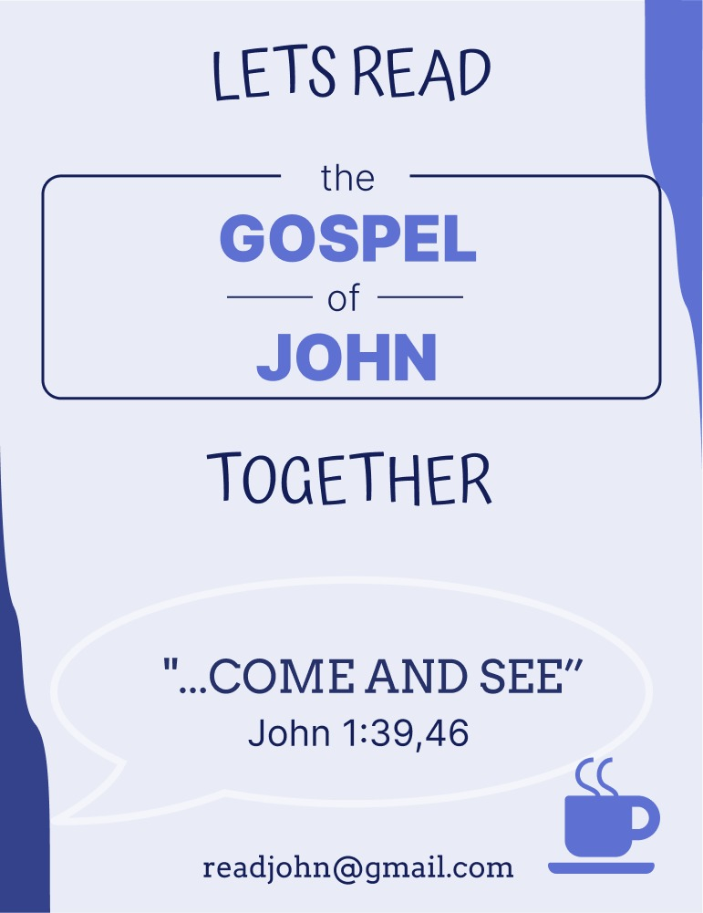

The Street Bible-Discovery project
====================================
> by The disciple who loves Jesus  
October 2022, Innsbruck, Austria

------------------------------------------------------------------
**TABLE OF CONTENT**:
<!-- TOC depthFrom:1 depthTo:6 withLinks:1 updateOnSave:1 orderedList:0 -->

- [The State-of-the-Ministry](#the-state-of-the-ministry)
	- [A priori](#a-priori)
	- [The Gap](#the-gap)
	- [A paradigm shift: From ministries to Movements](#a-paradigm-shift-from-ministries-to-movements)
- [Project description](#project-description)
- [Project management](#project-management)
	- [Milestones](#milestones)
- [The Street Bible Discovery](#the-street-bible-discovery)
	- [א - Alef discovery](#-alef-discovery)
	- [ב - Bet discovery](#-bet-discovery)
	- [ג - Gimel discovery](#-gimel-discovery)
- [Acronyms](#acronyms)
- [References](#references)

<!-- /TOC -->

> All Scripture quotations are taken from the ESV Bible (The Holy Bible, English Standard Version) [|5|](#references), unless stated otherwise.  
Corresponding author: [stefaniecg@icloud.com](mailto:stefaniecg@icloud.com)

------------------------------------------------------------------
# The State-of-the-Ministry

## A priori
Currently our evangelistic ministry is to make outreaches every week at Rapoldipark in Innsbruck, where our aim is to share the Gospel with the _'lost'_ [(Matthew 28:18-20)](https://my.bible.com/bible/59/MAT.28.18-20.).
Our method is to engage in one-to-one conversations with people [(John 4:7-30)](https://my.bible.com/bible/59/JHN.4.7-30).
The duration of each conversation depends on the leading of the Spirit [(Luke 12:12)](https://my.bible.com/bible/59/LUK.12.12), but it usually takes between 30 minutes to 1 hour.
We go two-by-two [(Luke 10:1)](https://my.bible.com/bible/59/LUK.10.1) and our aim is to sow seeds [(Matthew 13:3-23)](https://my.bible.com/bible/59/MAT.13.3-23.) by presenting the Gospel.

The audience ('_the type of Lost_') we encounter are in great majority atheist (deny the existence and belief in God), then agnostics (do not know if there is a God, but do not deny nor assert it), followed by muslims, catholics, Jehovas' witness, and one time a jewish person.

We present the Gospel through 5 gospel threads [|1|](#references) (milestones) along the conversation:
1. The Character of God
2. The Sinfulness of Man
3. The Sufficiency of Christ
4. The Necessity of Repentance, Faith, and the New birth
5. The Urgency of Eternity

At the end of the conversation, if the person accepts it:
1. We give a mini Gospel of John [(6)](#references) and encourage them to read it.
2. We pray for the person [(1 Timothy 2:1)](https://my.bible.com/bible/59/1TI.2.1).

## The Gap
I realized that through our current SoM we do not have a method to follow up with the people we talk to.
We usually never see them again.
Even though it is undeniably that God will grow that seed if it is His will [(1 Corinthians 3:9)](https://my.bible.com/bible/59/1CO.3.9), we do not have a method to follow up.
through our current method we can know: _'Where is each person at now? (Meet them)'_.
But our current SoM fails to follow up: _'What is their next step? (Move them)'_.
We want to change that.

## A paradigm shift: From ministries to Movements
The **Shiftm2M** seminar [|2|](#references) teaches leadership and disciple making Jesus-style.
The seminar takes the student through the life of Jesus, detecting milestones in his ministry on building a _disciple making movement_.
Jesus Ministry can be broken down into 6 phases, each phase starts with a milestone.
The ministry building process is illustrated in _Figure 1_.
Jesus' _disciple-making process_ took un-believers (_The lost_) and turned them into not only disciples, but _disciple-makers_.
The end stage of every human is to turn from being in the status of '_lost_' to the status of '_disciple-maker_'.
For people to move from one stage to another, Jesus Christ used a specific calling.
The process through which a _lost_ person goes to become a _disciple maker_ is shown in _Figure 2_.
The two charts previously discussed are related through the diagram shown in _Figure 3_.

**Milestones and Phases of the ministry that results in the Movement**: (Figure 1)

- **M0** - Birth of Jesus Christ [(Matthew 1:18)](https://my.bible.com/bible/59/MAT.1.18)
- _Phase 1_: Preparation period
- **M1** - Baptism of Jesus Christ [(Matthew 3:16)](https://my.bible.com/bible/59/MAT.3.16)
- _Phase 2_: Ministry foundations
- **M2** - Call of the four [(Matthew 4:18-22)](https://my.bible.com/bible/59/MAT.4.18-22)
- _Phase 3_: Ministry training
- _Phase 4_: Expanded outreach
- **M3** - Appointment of the twelve [(Mark 3:13-19)](https://my.bible.com/bible/59/MRK.3.13-19)
- _Phase 5_: Leadership multiplication
- **M4** - Death & Resurrection [(Matthew 27:50)](https://my.bible.com/bible/59/MAT.27.50), [(Matthew 28:9)](https://my.bible.com/bible/59/MAT.28.9)
- _Phase 6: The Movement_ of Multiplying disciples

**Jesus's callings and people stages while moving through the disciple-maker path**: (Figure 2)
> 'For the Son of Man came to seek and to save the lost.” ' [(Luke 19:10)](https://my.bible.com/bible/59/LUK.19.10)

- _Stage 0_: The lost  
- **C1** - Come and see [(John 1:39,46)](https://my.bible.com/bible/59/JHN.1.39,46)  
- _Stage 1_: The connected Lost  
- **C2** - Repent and believe [(Mark 1:15)](https://my.bible.com/bible/59/MRK.1.15.ESV)  
- New birth [(John 3:7)](https://my.bible.com/bible/59/JHN.3.7.ESV)  
- **C3** - Follow Me [(John 1:43)](https://my.bible.com/bible/59/JHN.1.43)
- _Stage 2_: The believer (the consumer)
- **C4** - Follow Me and fish for men [(Matthew 4:19)](https://my.bible.com/bible/59/MAT.4.19)
- _Stage 3_: The disciple (the worker in training)
- **C5** - Go bear much fruit [(John 15:16)](https://my.bible.com/bible/59/JHN.15.16.ESV)
- _Stage 4_: The disciple-maker
- **C6** - Go make disciples of all Nations [(Matthew 28:18)](https://my.bible.com/bible/59/MAT.28.18.)
- _Stage 5_: The missionary

_Note_: Stage 3 was re-named, the new birth, calling 6 (C6), and Stage 5 were added by the author, in comparison to the original Shiftm2M diagram.

---

__Figure 1__ - The _Ramp Chart_: Jesus Ministry, the process for building a disciple-makers movement [|3|](#references)

__Figure 2__ - The _Arrow Chart_: People in the disciple-maker process [|3|](#references)

__Figure 3__ - The _relationship_ between the Ramp and Arrow charts (two lenses) [|4|](#references)

------------------------------------------------------------------
# Project description

- **Aim**:
We want to close [the gap](#the-gap) in our current SoM by designing a method to follow up with _Lost_ people, and accompany them to take the next step in the arrow chart to become a _connected Lost_.
The calling is: **'Come and see'**.
We want to invite the lost to come see, and get to know our Lord, by inviting them to read The Gospel of John with us.
First invite them to 5 initial sessions, that if the Spirit wills, could be extended to other extra 7 sessions, in total 12 sessions.
Our hope and prayer is that at least a few [(Matthew 7:13-14)](https://my.bible.com/bible/59/MAT.7.13-14) become first believers, then disciples, and finally disciple-makers who can start the process with someone else.

- **Project characterization**:
The _street bible-discovery_ is a tool to discover the Bible with unbelievers in the street.
We want them to feel comfortable and that no one is forcing ideas on them.
Therefore our approach of reading the bible will be to discover it together.
There will be _no authoritative teaching_ of the Word of the Lord, rather it will be a joint/shared _discovery_ of scripture.
It is done in a group setting, minimum group is two.
This tool intends to take people from the stage of unbelief _'Lost'_ to the next stage of _'Connected Lost'_ (in the arrow_chart Figure 2).
The bible discovery will have 5 initial sessions, called the [Alef discovery](#alef-discovery).
If we succeed to go through the initial discovery, then we can continue with the next 7 follow-up sessions, called the [Bet discovery](#bet-discovery).
Each session will have a topic and a central question we want to answer with the group by reading specific verses of scripture.
The _bible discovery_ is an already existing tool used to read the bible with non believers [|8|](#references).
We will use a slightly modified version of its structure, prepare specific bible topics of _John's Gospel_.
As we target to use this for people mainly reached on the streets we call it _street bible discovery_.
The reason to use John's gospel is because we already give this material, so there is no need to acquire further material.
Even though, we prepare specific verses and structure for the meeting, we will rely on the guidance of the Spirit for its execution.
Therefore, the structure, topic, question is a guide that can be adapted.

- **Expected Outcome**:
Take the _lost_ we reach on the streets to (at least) the stage of _connected lost_.
In the long run, we would encourage them to repent, be baptized, and to receive the Holy Spirit, to become _believers_ [(Acts 2:38)](https://my.bible.com/bible/59/ACT.2.38).
But that can only be done by God, so prayer and leading of the Spirit is central to our method.

- **Target audience**:
The Lost [(Luke 19:10)](https://my.bible.com/bible/59/LUK.19.10), both woman and man.
We target mostly young people because of the language and the ease of communication.
But if the Spirit leads to older people there will be no problem.

- **Method**:
   1. Continue with our '[A priori](#a-priori)' current method of one-to-one conversations.  
   2. At the end of the conversation give the _Gospel of John_.  
   3. Invite them to think about what we spoke and invite them to consider meeting us for 5 _Alef bible discovery_ sessions. They will take the invitation, which includes the contact information to reach us via email.  
   4. We would meet the people and read the _Gospel of John_ according to the Alef discovery structure.  
   5. Do the 5 _Alef bible discovery_ sessions.
   6. At the end, invite for next 7 _Bet bible discovery_ sessions.
   * The prayer is that people repent and become believers at any time. Then we stop and they become part of the family, be baptized and come to our regular bible study bi-weekly meetings.

- **Structure of bible discovery meetings**:
The structure is a slightly modified version of the original bible discovery [|8|](#references).
The structure has 5 phases, each should last around 10 minutes, to make a total of 50 minutes for the whole session.
   1. **Exchange & Retrospective** - [Austauschen + Ruckblick]
      * What did you experience with God this week and what are you thankful for?
      * Where do you need God's help?
      * How can you be helped practically?
      * What have you implemented since the last meeting from what you learned?
      * How are the people you care most about doing? What are your next steps with them?
      * Who have you told about an experience of God? Have you prayed with someone?
   2. **Scripture** - [Lesen]
      * Everyone reads the text for themselves.
      * Someone reads the text aloud.
      * With closed Bibles, one after the other, we all retell the story of the text in our own words.
   3. **Discovery** - [Entdecken]
      * Did you notice anything special in the text?
      * What do you like and what bothers you?
      * What can you learn about God and people from this text?
   4. **Application** - [Anwenden]
      * How does the text change the way you think about God? And about how you live?
      * How is my interaction with other people shaped by the text?
      * What will you do with what you have learned before the next meeting?
      * Tell God in your own words what moved you.
   5. **Prayer** - [Gebet]
      * PRAY acronym by David Platt [(9)](#references)  
         - P - Praise - Worship God for who He is and what He has done.
         - R - Repent - Confess your sin to God and acknowledge your need for Jesus.
         - A - Ask - Intercession and petition for specific needs in your life and others’ lives.
         - Y - Yield - Surrender your life to following Jesus wherever and however He leads you.
      * Pray for each other.
      * Pray for the people who we shared what we learned last week.

- **Duration**
   * 1 session per week.
   * 1 hour per session.
   * Alef sessions would be finished in 5 weeks.

- **Team**:
   * Stefanie Castillo
   * Charles Effiong

- **Location**:
   * We intend this meeting to be informal, therefore we will meet at:
      * Rapoldipark (if warm enough)
      * Sill park lounge (if too cold)

- **Bible translation**:
   * We have been using the Johannes-Evangelium, the Elberfelder Übersetzung [(6)](#references),
   * but it might be easier for people to read of the Schlachter 2000 Übersetzung [(7)](#references).

- **Language**:
   * As needed by the person we will adapt:
      * German - for conversation & bible reading
      * English - main language for conversation

------------------------------------------------------------------
# Project management

## Milestones

| id  | milestone              | date       | description                                                              |
| --- | ---------------------- | ---------- | ------------------------------------------------------------------------ |
| M0  | project kickoff        | 7 Oct 2022 | Launch of the Project                                                    |
| M1  | project specification  | 8 Oct 2022 | Write the project concept                                                |
| M2  | design invitation      | on-going   | Design an invitation to the session and provide a contact email          |
| M3  | peer-review            | ?          | Ask for feedback of selected peers                                       |
| M4  | material production    | ?          | Print invitations, order John's Gospel, and set-up contact email address |
| M5  | project launch         | ?          | Take it to the streets                                                   |
| M6  | project implementation | ?          | Start the first Alef sessions                                            |

------------------------------------------------------------------
# The Street Bible Discovery

Discover God and the Bible through the Gospel of John.

## א - Alef discovery

* **Central topic**: The Gospel
* **Expected learning outcome**: Understand the Gospel (the good news)
* **Moderator**:  Charles & Stefanie

| id  | session | topic                                             | question                      | scriptures           |
| --- | ------- | ------------------------------------------------- | ----------------------------- | -------------------- |
| A1  | Alef 1  | The character of God                              | Who is Christ?                | John 1:1-18          |
| A2  | Alef 2  | The sinfulness of man                             | Are we sinners?               | John 4:1-29          |
| A3  | Alef 3  | The sufficiency of Christ                         | Why did Jesus died?           | John 1:29-36;3:14-17 |
| A4  | Alef 4  | The necessity of repentance, faith, and new birth | How to become a child of God? | John 3:1-8           |
| A5  | Alef 5  | The urgency of eternity                           | Does everyone go to heaven?   | John 3:18-21         |

* The invitation to the Alef discovery  

## ב - Bet discovery

* **Central topic**: God's (Yahweh, Jesus, and the Holy Spirit) character.
* **Expected learning outcome**: Know God + self-reading of bible for participants.
* **Moderator**: We all rotate the leading of the session with pre-prepared questions, including participants.

| id  | session | topic                | question                                       | scriptures    |
| --- | ------- | -------------------- | ---------------------------------------------- | ------------- |
| B1  | Bet 1   | The character of God | Why Jesus is the Bread of life?                | John 6:1-69   |
| B2  | Bet 2   | The character of God | Why Jesus is the Light of the world?           | John 8:2-36   |
| B3  | Bet 3   | The character of God | Why Jesus is the Door?                         | John 9:1-10:9 |
| B4  | Bet 4   | The character of God | Why Jesus is the Good shepherd                 | John 10:10-30 |
| B5  | Bet 5   | The character of God | Why Jesus is the Resurrection ?                | John 11:1-46  |
| B6  | Bet 6   | The character of God | Why Jesus is the Way, the Truth, and the life? | John 14:1-13  |
| B7  | Bet 7   | The character of God | Why Jesus is the Vine?                         | John 15:1-17  |

## ג - Gimel discovery

* **Central topic**: Based on the elementary doctrines of [Hebrews 6:1-2 ](https://my.bible.com/bible/59/HEB.6.1-2).
* **Expected learning outcome**: Stand firm on the elementary doctrines of Christianity.
* **Moderator**: We all rotate the leading of the session with pre-prepared questions, including participants.

| id  | session | topic                | question                           | scriptures |
| --- | ------- | -------------------- | ---------------------------------- | ---------- |
| G1  | Gimel 1 | Elementary doctrines | What is repentance?                |            |
| G2  | Gimel 2 | Elementary doctrines | What is faith?                     |            |
| G3  | Gimel 3 | Elementary doctrines | What is baptism?                   |            |
| G4  | Gimel 4 | Elementary doctrines | What is lying of hands?            |            |
| G5  | Gimel 5 | Elementary doctrines | What is resurrection of the death? |            |
| G6  | Gimel 6 | Elementary doctrines | What is eternal judgement?         |            |

------------------------------------------------------------------
# Acronyms
- SoM: State of the Ministry

------------------------------------------------------------------
# References
[1] Platt, David, "Gospel Threads," Radical Inc, 2017. [|Available online|](https://radical.net/book/gospel-threads-2/)  
[2] Shiftm2M Seminar. Campus für Christus. Saalfelden, Austria. August 2022. [|Available online|](https://www.campusaustria.at/bereiche/shift/)  
[3] Roennfeldt, Peter. “The movement strategy of Jesus in the Early Church,” PowerToChange, Australia, 2016. [|Available online|](https://www.movementbuilders.com.au/wp-content/uploads/SHIFTm2M_eArticle-The_Movement_Strategy_of_Jesus_in_the_Early_Church.pdf)  
[4] Hodgson, Bill. “Movements in 3D,” PowerToChange, Australia, 2016. [|Available online|](https://www.movementbuilders.com.au/wp-content/uploads/SHIFTm2M_eBook-Movements_in_3D.pdf)  
[5] English Standard Version. Crossway. [|Available online|](https://www.esv.org)   
[6] Johannes-Evangelium. Elberfelder Übersetzung. Verbreitung der Heiligen Schrift e.V., D-35713 Eschenburg [|Available online|](https://www.vdhs.de/index.php?shop.article.884&tax=11357)  
[7] Johannes-Evangelium. Schlachter 2000 Übersetzung. Christliche Literatur-Verbreitung e.V., 33649 Bielefeld [|Available online|](https://clv.de/Schlachter-2000-Bibel-Johannes-Evangelium/256420)  
[8] My friends: Bible Discovery. MyFriends Ministry, Campus für Christus Schweiz, CH-8005 Zürich [|Available online|](https://myfriends.life/biblediscovery/)  
[9] Platt, David, "PRAY and FAST", 6 January 2019. [|Available online|](https://radical.net/podcasts/radical-podcast/pray-and-fast/)
