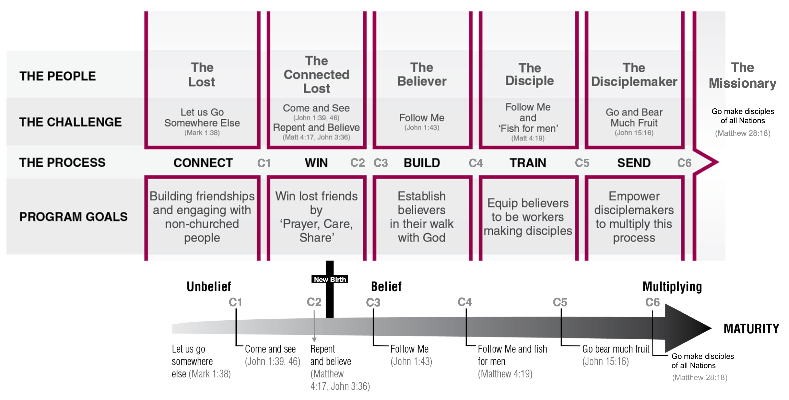
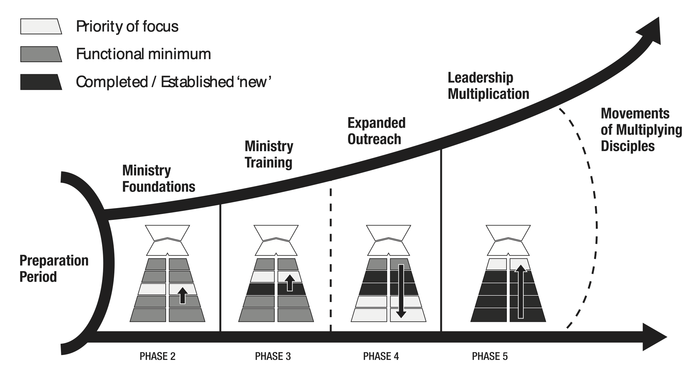
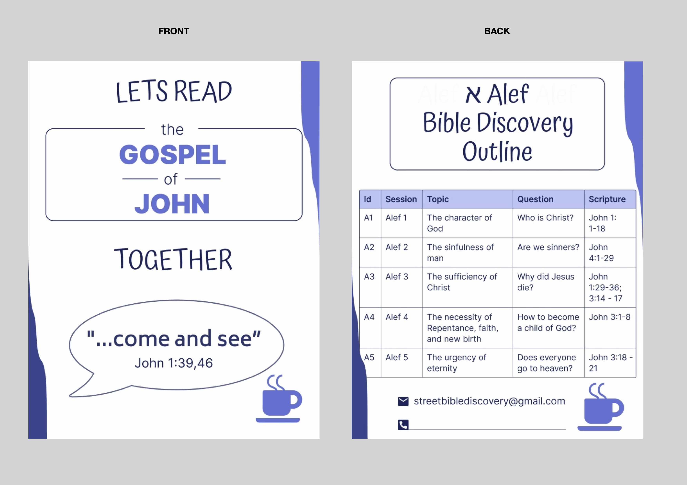

The Street Bible-Discovery project
====================================
> by The disciple who loves Jesus  
7 October 2022, Innsbruck, Austria

------------------------------------------------------------------
**TABLE OF CONTENT**:
<!-- TOC depthFrom:1 depthTo:6 withLinks:1 updateOnSave:1 orderedList:0 -->

- [The State-of-the-Ministry](#the-state-of-the-ministry)
	- [A priori](#a-priori)
	- [The Gap](#the-gap)
	- [A paradigm shift: From ministries to Movements](#a-paradigm-shift-from-ministries-to-movements)
- [Project description](#project-description)
- [Project management](#project-management)
	- [Milestones](#milestones)
- [The Street Bible Discovery](#the-street-bible-discovery)
	- [א - Alef discovery](#-alef-discovery)
	- [ב - Bet discovery](#-bet-discovery)
	- [ג - Gimel discovery](#-gimel-discovery)
- [Acronyms](#acronyms)
- [References](#references)
- [Footnotes](#footnotes)

<!-- /TOC -->

> All Scripture quotations are taken from the ESV Bible (The Holy Bible, English Standard Version) [|5|](#references), unless stated otherwise.  
Corresponding author: [stefaniecg@icloud.com](mailto:stefaniecg@icloud.com)

------------------------------------------------------------------
# The State-of-the-Ministry

## A priori
Currently our evangelistic ministry is to make outreaches every week at Rapoldipark in Innsbruck, where our aim is to share the Gospel with _the lost_ [(Matthew 28:18-20)](https://my.bible.com/bible/59/MAT.28.18-20.).
Our method is to engage in one-to-one conversations with people [(John 4:7-30)](https://my.bible.com/bible/59/JHN.4.7-30).
The duration of each conversation depends on the leading of the Spirit [(Luke 12:12)](https://my.bible.com/bible/59/LUK.12.12), but it usually takes between 30 minutes to 1 hour.
We go two-by-two [(Luke 10:1)](https://my.bible.com/bible/59/LUK.10.1) and our aim is to sow seeds [(Matthew 13:3-23)](https://my.bible.com/bible/59/MAT.13.3-23.) by presenting the Gospel.

The audience (_the type of lost_) we encounter are in great majority atheist (deny the existence and belief in God), then agnostics (do not know if there is a God, but do not deny nor assert it), followed by muslims, catholics, Jehovas' witness, and one time a jewish person.

We present the Gospel through 5 core-gospel threads [|1|](#references) (milestones) along the conversation:
1. The Character of God
2. The Sinfulness of Man
3. The Sufficiency of Christ
4. The Necessity of Repentance, Faith, and the New birth
5. The Urgency of Eternity

At the end of the conversation, if the person accepts it:
1. We give a mini Gospel of John [(6)](#references) and encourage them to read it.
2. We pray for the person [(1 Timothy 2:1)](https://my.bible.com/bible/59/1TI.2.1).

## The Gap
The goal of our ministry has always been to meet people, share the Gospel, and make disciples.
We succeed to share the core of the Gospel with the people, but the usual case of our encounters is that after planting the Gospel seed, we never see the them again (with a few exceptions).
Our current SoM does not have a clearly outlined method to follow up with the people we talk to.
Even though it is undeniable that God will grow that seed if it is His will [(1 Corinthians 3:9)](https://my.bible.com/bible/59/1CO.3.9), we do not have a method to follow up with the people.
Through our current method we share the Gospel with the _lost_ and can know: _'Where is each person at now? (Meet them)'_, but it fails to follow up: _'What is their next step? (Move them)'_.
We want to close the gap that by devising a clearly outlined method to follow up with the people we encounter: invite them to a follow up encounter.

## A paradigm shift: From ministries to Movements
The **Shiftm2M** seminar [|2|](#references) teaches leadership and disciple making Jesus-style.
The seminar takes the student through the life of Jesus, detecting milestones in his ministry on building a _disciple making movement_.
Jesus Ministry can be broken down into 6 phases, each phase starts with a milestone.
The ministry building process is illustrated in [Figure 1](#ramp_chart).
Jesus' _disciple-making process_ took un-believers (_The lost_) and turned them into not only disciples, but _disciple-makers_.
The end stage of every human is to turn from being in the status of '_lost_' to the status of '_disciple-maker_'.
For people to move from one stage to another, Jesus Christ used a specific calling.
The process through which a _lost_ person goes to become a _disciple maker_ is shown in [Figure 2](#arrow_chart).
The two charts previously discussed are related through the diagram shown in [Figure 3](#relation_chart).

**Milestones and Phases of the ministry that results in the Movement**: [(Figure 1)](#ramp_chart)

- **M0** - Birth of Jesus Christ [(Matthew 1:18)](https://my.bible.com/bible/59/MAT.1.18)
- _Phase 1_: Preparation period
- **M1** - Baptism of Jesus Christ [(Matthew 3:16)](https://my.bible.com/bible/59/MAT.3.16)
- _Phase 2_: Ministry foundations
- **M2** - Call of the four [(Matthew 4:18-22)](https://my.bible.com/bible/59/MAT.4.18-22)
- _Phase 3_: Ministry training
- _Phase 4_: Expanded outreach
- **M3** - Appointment of the twelve [(Mark 3:13-19)](https://my.bible.com/bible/59/MRK.3.13-19)
- _Phase 5_: Leadership multiplication
- **M4** - Death & Resurrection [(Matthew 27:50)](https://my.bible.com/bible/59/MAT.27.50), [(Matthew 28:9)](https://my.bible.com/bible/59/MAT.28.9)
- _Phase 6_: The **Movement** of Multiplying disciples

**Jesus's callings and people stages while moving through the disciple-maker path**: [(Figure 2)](#arrow_chart)
> 'For the Son of Man came to seek and to save the lost.” ' [(Luke 19:10)](https://my.bible.com/bible/59/LUK.19.10)

- _Stage 0_: The lost  
- **C1** - Come and see [(John 1:39,46)](https://my.bible.com/bible/59/JHN.1.39,46)  
- _Stage 1_: The connected Lost  
- **C2** - Repent and believe [(Mark 1:15)](https://my.bible.com/bible/59/MRK.1.15.ESV)  
- **New birth** [(John 3:7)](https://my.bible.com/bible/59/JHN.3.7.ESV)  
- **C3** - Follow Me [(John 1:43)](https://my.bible.com/bible/59/JHN.1.43)
- _Stage 2_: The believer (the consumer)
- **C4** - Follow Me and fish for men [(Matthew 4:19)](https://my.bible.com/bible/59/MAT.4.19)
- _Stage 3_: The disciple (the worker in training)
- **C5** - Go bear much fruit [(John 15:16)](https://my.bible.com/bible/59/JHN.15.16.ESV)
- _Stage 4_: The disciple-maker
- **C6** - Go make disciples of all Nations [(Matthew 28:18)](https://my.bible.com/bible/59/MAT.28.18.)
- _Stage 5_: The missionary

_Note_: Stage 3 was re-named, the new birth, calling 6 (C6), and Stage 5 were added by the author, in comparison to the original Shiftm2M diagram.

>'And Jesus came and said to them, “All authority in heaven and on earth has been given to me. **Go therefore and make disciples** of all nations, baptizing them in the name of the Father and of the Son and of the Holy Spirit, teaching them to observe all that I have commanded you. And behold, I am with you always, to the end of the age.”' [(Matthew 28:18-20)](https://my.bible.com/bible/59/MAT.28.18-20)

---
__Figure 1__ - The _Ramp Chart_: Jesus Ministry, the process for building a disciple-makers movement [|3|](#references)

__Figure 2__ - The _Arrow Chart_[^1]: People in the disciple-maker process [|3|](#references)

__Figure 3__ - The _relationship_ between the Ramp and Arrow charts (two lenses) [|4|](#references)

------------------------------------------------------------------
# Project description

- **Aim**:
We want to close [the gap](#the-gap) in our current SoM by designing a clearly outlined method to follow up with _lost_, and accompany them to take the next step in their path with the Lord, in the arrow chart to become at the least a _connected lost_.
The calling is: **'Come and see'**.
We want to invite the lost to come see, and get to know our Lord, by inviting them to read The Gospel of John with us.
First invite them to 5 initial sessions, that if the Spirit wills, could be extended to other extra 7 sessions, in total 12 sessions.
Our hope and prayer is that (at least) a few [(Matthew 7:13-14)](https://my.bible.com/bible/59/MAT.7.13-14) become first believers, then disciples, and finally disciple-makers who can start the process with someone else and multiply.

- **Project characterization**:
The _street bible-discovery_ is a tool to discover the Bible with unbelievers in the street.
We want them to feel comfortable and that no one is forcing ideas on them.
Therefore our approach of reading the bible will be to discover it together.
There will be _no authoritative teaching_ of the Word of the Lord, rather it will be a joint/shared _discovery_ of scripture.
It is done in a group setting, minimum group size is two.
This tool intends to take people from the stage of unbelief _'lost'_ to (at the least) the next stage of _'connected Lost'_ (in the arrow_chart [Figure 2](#arrow_chart)).
The bible discovery will have 5 initial sessions, called the [Alef discovery](#alef-discovery).
We assume it is easier for someone to consider going through a small number of sessions, therefore we have proposed 5 initial sessions.
Either way the bible discovery can be stoped at any point in time and there are no strings attached, it is just a friendly invitation to know more about God.
If we succeed to go through the initial Alef discovery, then we can continue with the next 7 follow-up sessions, called the [Bet discovery](#bet-discovery).
Each session will have a topic and a central question we want to answer with the group by reading specific verses of scripture.
The _bible discovery_ is an already existing tool used to read the bible with non believers [|8|](#references).
We will use a slightly modified version of its structure and read specific verses in _John's Gospel_ to cover a topic.
As we target to use this for people mainly reached on the streets we call it _street bible discovery_.
The reason to use John's gospel is because we already give this material, so there is no need to acquire any different material.
Even though, we prepare specific verses and a structure for the meeting, we will rely on the guidance of the Spirit for its execution.
Therefore, the structure, topic, and question are only a guide that can be adapted.

- **Expected Outcome**:
Take the _lost_ we reach on the streets to (at least) the stage of _connected lost_.
In the long run, we would encourage them to repent, be baptized, and to receive the Holy Spirit, to become _believers_ [(Acts 2:38)](https://my.bible.com/bible/59/ACT.2.38).
But the _new birth_ can only be done by God, so prayer and leading of the Spirit is central to our method.
There is nothing we can do without the power and the guidance of the Holy Spirit.

- **Target audience**:
The Lost [(Luke 19:10)](https://my.bible.com/bible/59/LUK.19.10), both woman and man of at least 18 years old.
We target mostly young people because of the language and the ease of communication.
But if the Spirit leads to older people there will be no problem.

- **Method**:
   1. Continue with our '[A priori](#a-priori)' current method of one-to-one conversations.  
   2. At the end of the conversation give the _Gospel of John_.  
   3. Invite them to think about what we spoke and invite them to consider meeting us for 5 _Alef bible discovery_ sessions. They will take the invitation, which includes the contact information to reach us via email.  
   4. We would meet the people and read the _Gospel of John_ according to the Alef discovery structure.  
   5. Do the 5 _Alef bible discovery_ sessions.
   6. At the end, invite for next 7 _Bet bible discovery_ sessions.
The prayer is that people repent and become believers at any time. Then we stop and they become part of the family, be baptized and come to our regular bible study bi-weekly meetings.

- **Structure of bible discovery meetings**:
The structure is a slightly modified version of the original bible discovery [|8|](#references).
The structure has 5 phases, each should last around 10 minutes, to make a total of 50 minutes for the whole session.
   1. **Exchange & Retrospective** - [Austauschen + Ruckblick]
      * What did you experience with God this week and what are you thankful for?
      * Where do you need God's help?
      * How can you be helped practically?
      * What have you implemented since the last meeting from what you learned?
      * Have you shared what you've discovered in these sessions with someone? What are your next steps with them?
      * Who have you told about an experience of God? Have you prayed with someone?
   2. **Scripture** - [Lesen]
      * We all take turns to read the bible verses out laud for the group.
      * With closed Bibles, one after the other, we all retell the story of the text in our own words.
   3. **Discovery** - [Entdecken]
      * Did you notice anything special in the text?
      * What do you like and what bothers you?
      * What can you learn about God and people from this text?
   4. **Application** - [Anwenden]
      * How does the text change the way you think about God? And about how you live?
      * How is my interaction with other people shaped by the text?
      * What will you do with what you have learned before the next meeting?
      * Tell God in your own words what moved you.
      * => ANSWER THE SESSION'S QUESTION
   5. **Prayer** - [Gebet]
      * PRAY acronym by David Platt [(9)](#references)  
         - P - Praise - Worship God for who He is and what He has done.
         - R - Repent - Confess your sin to God and acknowledge your need for Jesus.
         - A - Ask - Intercession and petition for specific needs in your life and others’ lives.
         - Y - Yield - Surrender your life to following Jesus wherever and however He leads you.
      * Pray for each other.
      * Pray for the people who we shared what we learned last week.

- **Dynamic of the Group**:
The _saints_ are referred to as moderators in this sessions.
We as moderators need to remember that we are reading the bible with _non-believers_.
This is a different setting as the normal _church_ setting, for this is NOT a _bible study_ but rather a _bible discovery_.
In these discovery-sessions all participants are invited to share their opinion about scripture without retaliation, but rather with tolerance, humbleness, and kindness we are all called to share our interpretation of scripture.
Active involvement of all participants is needed, included the moderators as just participants.
Remember in this group setting there is no stablished _order_, as we are all reading and discovering the Word of the Lord together.
We have to tolerate the opinion of the _lost_, yet always being ready to respectfully, kindly, and gently give a defense for the reason of the hope that is in us [(1 Peter 3:15)](https://my.bible.com/bible/59/1PE.3.15).

   * Beware of divisions among the moderators, for satan will do anything to divide the team in order to stop the reading of the Word with the _lost_. Be wise as serpents and innocent as doves,

>'Beloved, do not be surprised at the fiery trial when it comes upon you to test you, as though something strange were happening to you. '[(1 Peter 4:12)](https://my.bible.com/bible/59/1PE.4.12)
>'but in your hearts honor Christ the Lord as holy, always being prepared to make a defense to anyone who asks you for a reason for the hope that is in you; yet do it with gentleness and respect, ' [(1 Peter 3:15)](https://my.bible.com/bible/59/1PE.3.15)
> ' “Behold, I am sending you out as sheep in the midst of wolves, so be wise as serpents and innocent as doves. ' [(Matthew 10:16)](https://my.bible.com/bible/59/MAT.10.16)

- **Duration**:
Alef sessions would be finished in 5 weeks.
   * 1 session per week.
   * 1 hour per session.

- **Core team**:
   * Charles Effiong
   * Stefanie Castillo

- **Location**:
We intend this meeting to be informal, therefore we will meet at:
   * Rapoldipark (if warm enough)
   * Sill park lounge (if too cold)

- **Bible translation**:
   * We have been using the Johannes-Evangelium, the Elberfelder Übersetzung [(6)](#references),
   * but it might be easier for us and people to read of the Schlachter 2000 Übersetzung [(7)](#references).

- **Language**:
As needed by the person we will adapt:
   * English - main language for conversation
   * German - for conversation & bible reading

- **Group size**:
At the least one of member of the core team should be present, better is both.
Participants should be at least one, maximum 3 so that the group stays manageable.

- **Project scope**:
   * Our team will implement this project on the streets of Innsbruck, handing out the _Alef bible discovery_ invitation as a follow up to the encounters that we already have.
   * Yet, the reach of this concept can be even greater as the framework presented here: the Alef Bible-discovery outline, the structure of the meetings, the material (mini Gospel of John), and the invitation itself can be used by any _saint_ as an evangelistic invitation to any _lost_ to **"Come and See"** [(John 1:39,46)](https://my.bible.com/bible/59/JHN.1.39,46).
   The _Alef bible discovery_ is just an invitation with pre-selected content for any _saint_ to discover the bible with any _lost_.
   Every _saint_ can rely on the guidance of the _Holy Spirit_ to discover the bible with any _lost_.
   Thus, we encourage other _saints_ to use the framework presented here to simply _invite_ and _read_ the Gospel of John with whoever God places in your life to disciple: a friend, a co-worker, a stranger, a family member, people on the street.
   Any _saint_ can order Gospels of John in the following links [(6,7)](#references) and we want to distribute pre-printed invitations for _saints_ to take with them into the world on a daily-bases.
   The invitation is just an outline of the content to discuss in the _Alef bible discovery_.
   * Therefore, all the invitations will not have pre-written contact email/address, but it will have an open space so that any _saint_ can write his/her contact when handing out the invitation.
   Our team will write the contact number/email when we hand out the invitations at the end of our conversation.
   * Every _saint_ is on his/her own walk trough the disciple-maker process shown in the arrow chart [(Figure 2)](#arrow_chart): where are you?
   * _Saints_ can encourage/help _one another_ ([Allelon (ἀλλήλων)](https://www.blueletterbible.org/lexicon/g240/kjv/tr/0-1/)) to know God more and grow in their path of becoming a disciple-maker.

> “The harvest is plentiful, but the laborers are few; therefore pray earnestly to the Lord of the harvest to send out laborers into his harvest.” [(Matthew 9:37-38)](https://my.bible.com/bible/59/MAT.9.37-38)  

------------------------------------------------------------------
# Project management

## Milestones

| id  | milestone              | date        | description                                                                   |
| --- | ---------------------- | ----------- | ----------------------------------------------------------------------------- |
| M0  | project kickoff        | 7 Oct 2022  | Launch of the Project                                                         |
| M1  | project specification  | 10 Oct 2022 | Write the project concept                                                     |
| M2  | design invitation      | 29 Oct 2022 | Design an invitation to the bible discovery and provide a contact email       |
| M3  | peer-review            | on-going    | Ask for feedback from selected peers                                          |
| M4  | material production    | ?           | Print invitations, order mini John's Gospel, and set-up contact email address |
| M5  | project launch         | ?           | Take it to the streets                                                        |
| M6  | project implementation | ?           | Start the first Alef sessions                                                 |

------------------------------------------------------------------
# The Street Bible Discovery

The project intends to provide a framework to discover God and the Bible with non-believers, through the reading of the Gospel of John together.
For the time being, only the **Alef discovery** will be launched to the streets.
All other following _bible discovery_ programs are described here, but they will be launched to the streets only if/when the _Lord of the Harvest_ [(Matthew 9:37-38)](https://my.bible.com/bible/59/MAT.9.37-38) provides growth of the first Alef seeds.
Yet we encourage others who have peers in other stages of the disciple-maker path, to use this framework to help people grow into the maturity of disciple-makers.

## א - Alef discovery

* **Central topic**: The Gospel
* **Expected learning outcome**: Understand the Gospel (the good news)
* **Moderator**:  Charles & Stefanie

| id  | session | topic                                                 | question                      | scriptures            |
| --- | ------- | ----------------------------------------------------- | ----------------------------- | --------------------- |
| A1  | Alef 1  | The character of God                                  | Who is Christ?                | John 1:1-18           |
| A2  | Alef 2  | The sinfulness of man                                 | Are we sinners?               | John 4:1-29           |
| A3  | Alef 3  | The sufficiency of Christ                             | Why did Jesus died?           | John 1:29-36; 3:14-17 |
| A4  | Alef 4  | The necessity of repentance, faith, and the new birth | How to become a child of God? | John 3:1-8            |
| A5  | Alef 5  | The urgency of eternity                               | Does everyone go to heaven?   | John 3:18-21          |

* The invitation to the Alef discovery  

## ב - Bet discovery

* **Central topic**: The character of God: Yahweh [יְהוָ֥ה], Jesus Christ [Ἰησοῦ Χριστοῦ], and the Holy Spirit [רוּחַ - πνεῦμα].
* **Expected learning outcome**: Know God + self-reading of bible for participants.
* **Moderator**: We all rotate the leading of the session with pre-prepared questions, including participants.

| id  | session | topic                | question                                       | scriptures    |
| --- | ------- | -------------------- | ---------------------------------------------- | ------------- |
| B1  | Bet 1   | The character of God | Why Jesus is the Bread of life?                | John 6:1-69   |
| B2  | Bet 2   | The character of God | Why Jesus is the Light of the world?           | John 8:2-36   |
| B3  | Bet 3   | The character of God | Why Jesus is the Door?                         | John 9:1-10:9 |
| B4  | Bet 4   | The character of God | Why Jesus is the Good shepherd                 | John 10:10-30 |
| B5  | Bet 5   | The character of God | Why Jesus is the Resurrection ?                | John 11:1-46  |
| B6  | Bet 6   | The character of God | Why Jesus is the Way, the Truth, and the life? | John 14:1-13  |
| B7  | Bet 7   | The character of God | Why Jesus is the Vine?                         | John 15:1-17  |

## ג - Gimel discovery

* **Central topic**: Based on the elementary doctrines of [Hebrews 6:1-2 ](https://my.bible.com/bible/59/HEB.6.1-2).
* **Expected learning outcome**: Stand firm on the elementary doctrines of Christianity.
* **Moderator**: We all rotate the leading of the session with pre-prepared questions, including participants.

| id  | session | topic                | question                           | scriptures |
| --- | ------- | -------------------- | ---------------------------------- | ---------- |
| G1  | Gimel 1 | Elementary doctrines | What is repentance?                |            |
| G2  | Gimel 2 | Elementary doctrines | What is faith?                     |            |
| G3  | Gimel 3 | Elementary doctrines | What is baptism?                   |            |
| G4  | Gimel 4 | Elementary doctrines | What is lying of hands?            |            |
| G5  | Gimel 5 | Elementary doctrines | What is resurrection of the death? |            |
| G6  | Gimel 6 | Elementary doctrines | What is eternal judgement?         |            |

------------------------------------------------------------------
# Acronyms
- SoM: State of the Ministry

------------------------------------------------------------------
# References
[1] Platt, David, "Gospel Threads," Radical Inc, 2017. [|Available online|](https://radical.net/book/gospel-threads-2/)  
[2] Shiftm2M Seminar. Campus für Christus. Saalfelden, Austria. August 2022. [|Available online|](https://www.campusaustria.at/bereiche/shift/)  
[3] Roennfeldt, Peter. “The movement strategy of Jesus in the Early Church,” PowerToChange, Australia, 2016. [|Available online|](https://www.movementbuilders.com.au/wp-content/uploads/SHIFTm2M_eArticle-The_Movement_Strategy_of_Jesus_in_the_Early_Church.pdf)  
[4] Hodgson, Bill. “Movements in 3D,” PowerToChange, Australia, 2016. [|Available online|](https://www.movementbuilders.com.au/wp-content/uploads/SHIFTm2M_eBook-Movements_in_3D.pdf)  
[5] English Standard Version. Crossway. [|Available online|](https://www.esv.org)   
[6] Johannes-Evangelium. Elberfelder Übersetzung. Verbreitung der Heiligen Schrift e.V., D-35713 Eschenburg [|Available online|](https://www.vdhs.de/index.php?shop.article.884&tax=11357)  
[7] Johannes-Evangelium. Schlachter 2000 Übersetzung. Christliche Literatur-Verbreitung e.V., 33649 Bielefeld [|Available online|](https://clv.de/Schlachter-2000-Bibel-Johannes-Evangelium/256420)  
[8] My friends: Bible Discovery. MyFriends Ministry, Campus für Christus Schweiz, CH-8005 Zürich [|Available online|](https://myfriends.life/biblediscovery/)  
[9] Platt, David, "PRAY and FAST", 6 January 2019. [|Available online|](https://radical.net/podcasts/radical-podcast/pray-and-fast/)

------------------------------------------------------------------
# Footnotes
[^1]: This figure has been enhanced (new concepts) from the original SHIFTm2M diagram [(3)](#references).
